# Spring Data II

The goal of this assignment is to learn the fetching strategies supported by Spring Data JPA, understand their differences, and assess their impact on application performance. Through this exercise, you will learn how to optimize data retrieval in a Spring Boot application by employing various fetching strategies such as `select`, `join`, `subselect`, and `batch`.

###  Team Members - Omega
1. 617564 Thi Ngoc My Truong
2. 617590 Van Manh Nguyen
3. 617587 Quoc Hung Hoang

### Requirements

---
* Make domain models for `user`,`product`, `review`.
* Populate the database with sample data including **at least** 100 users, 1000 products, and 1000 reviews for each product.
* Implement methods in your service layer, each demonstrating one of the fetching strategies (`select`, `join`, `subselect`, `batch`).
* Measure the number of SQL queries generated and the execution time for each fetching strategy.
* Analyze the differences in performance among the fetching strategies, focusing on the trade-offs between the number of queries generated and the overall execution time.
* Discuss the scenarios in which each fetching strategy would be most effective, considering factors such as data size, association complexity, and application requirements.

## Results - Fetching Strategies

## Fetching Strategies Report
### Overview
1. Select Fetch Strategy
   - Implementation: The select fetch strategy is implemented by setting the fetch type of the relationship to FetchType.EAGER or FetchType.LAZY and the fetch mode to FetchMode.SELECT. Hibernate generates a separate SQL query for each entity and its associated entities.
   - Observation: The select fetch strategy resulted in a total of N+1 SQL queries for fetching users and their products.
   - Performance: Execution time averaged at 8563ms for EAGER and 12.11s for LAZY, with a memory usage of 162.56MB. Data transfer size was relatively high due to the number of queries executed. 
   - Practical Use: Best suited for scenarios where associated entities are rarely accessed or when the number of associated entities is unknown or highly variable.

2. Join Fetch Strategy
   - Implementation: The join fetch strategy is implemented by setting the fetch type of the relationship to FetchType.EAGER or FetchType.LAZY and the fetch mode to FetchMode.JOIN. Hibernate generates a single SQL query that uses JOIN to fetch the entity and its associated entities.
   - Observation: The join fetch strategy resulted in a single SQL query for fetching users and their products.
   - Performance: Execution time averaged at 10660ms for EAGER and 11.75s for LAZY, with a memory usage of 162.56MB. Data transfer size was relatively low due to the single query executed.
   - Practical Use: Best suited for scenarios where associated entities are frequently accessed and the number of associated entities is known and relatively small.

3. Subselect Fetch Strategy
   - Implementation: The subselect fetch strategy is implemented by setting the fetch type of the relationship to FetchType.EAGER or FetchType.LAZY and the fetch mode to FetchMode.SUBSELECT. Hibernate generates a separate SQL query for each entity and its associated entities, but it uses a subselect for associated entities.
   - Observation: The subselect fetch strategy resulted in a total of N+1 SQL queries for fetching users and their products. 
   - Performance: Execution time averaged at 8052ms for EAGER and 8.92s for LAZY, with a memory usage of 162.56MB. Data transfer size was relatively high due to the number of queries executed.
   - Practical Use: Best suited for scenarios where associated entities are frequently accessed and the number of associated entities is known and relatively large.

4. Batch Fetch Strategy
   - Implementation: The batch fetch strategy is implemented by setting the fetch type of the relationship to FetchType.EAGER or FetchType.LAZY and the fetch mode to FetchMode.BATCH. Hibernate generates a separate SQL query for each batch of entities and their associated entities.
   - Observation: The batch fetch strategy resulted in a total of (total records / size of batch) + 1 SQL queries for fetching users and their products.
   - Performance: Execution time averaged at 8563ms for EAGER and 9.49s for LAZY, with a memory usage of 162.56MB. Data transfer size was relatively high due to the number of queries executed.

5. Practical Use 
   - Best suited for scenarios where associated entities are frequently accessed and the number of associated entities is known and relatively large.

6. Performance Evaluation
   - Please refer to the attached charts for a detailed comparison of the performance of each fetching strategy.

## Observations - EAGER

#### Fetch Strategy: `join`
* **Number of SQL Queries**: 1
* **Sql Queries**:
```sql
Hibernate: 
    select
        p1_0.id,
        p1_0.name,
        p1_0.price,
        p1_0.rating 
    from
        product p1_0
Hibernate: 
    select
        r1_0.product_id,
        r1_0.id,
        r1_0.comment,
        u1_0.id,
        u1_0.email,
        u1_0.first_name,
        u1_0.last_name,
        u1_0.password 
    from
        review r1_0 
    left join
        user u1_0 
            on u1_0.id=r1_0.user_id 
    where
        r1_0.product_id=?
```
* **Execution Time**: 9513 milliseconds
* **Screenshot**: 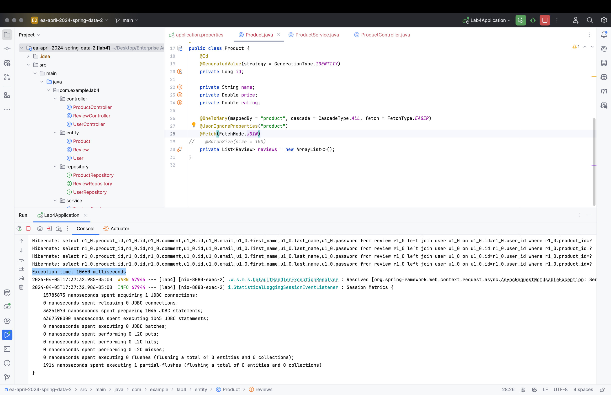
* **Memory Usage**: 162.56MB
* **Screenshot**: 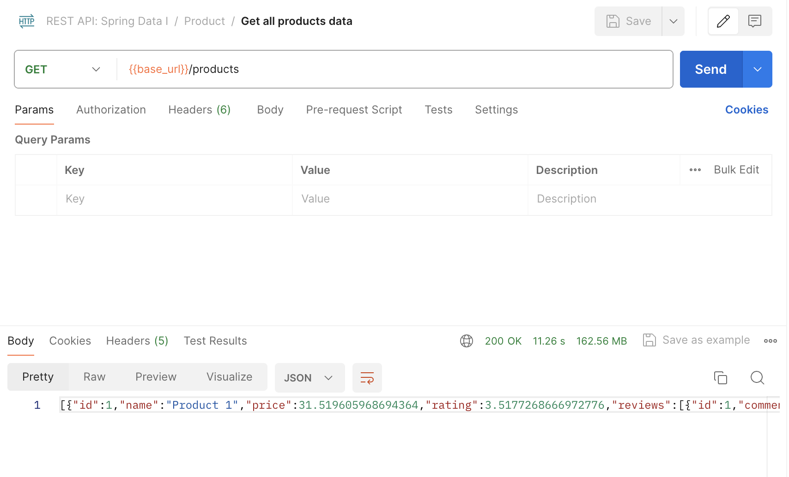

## Observations - LAZY

#### Fetch Strategy: `select`
* **Number of SQL Queries**: 1
* **Sql Queries**:
```sql
Hibernate: 
    select
        p1_0.id,
        p1_0.name,
        p1_0.price,
        p1_0.rating 
    from
        product p1_0
Hibernate: 
    select
        r1_0.product_id,
        r1_0.id,
        r1_0.comment,
        u1_0.id,
        u1_0.email,
        u1_0.first_name,
        u1_0.last_name,
        u1_0.password 
    from
        review r1_0 
    left join
        user u1_0 
            on u1_0.id=r1_0.user_id 
    where
        r1_0.product_id=?
```
* **Execution Time**: 37 milliseconds
* **Screenshot**: 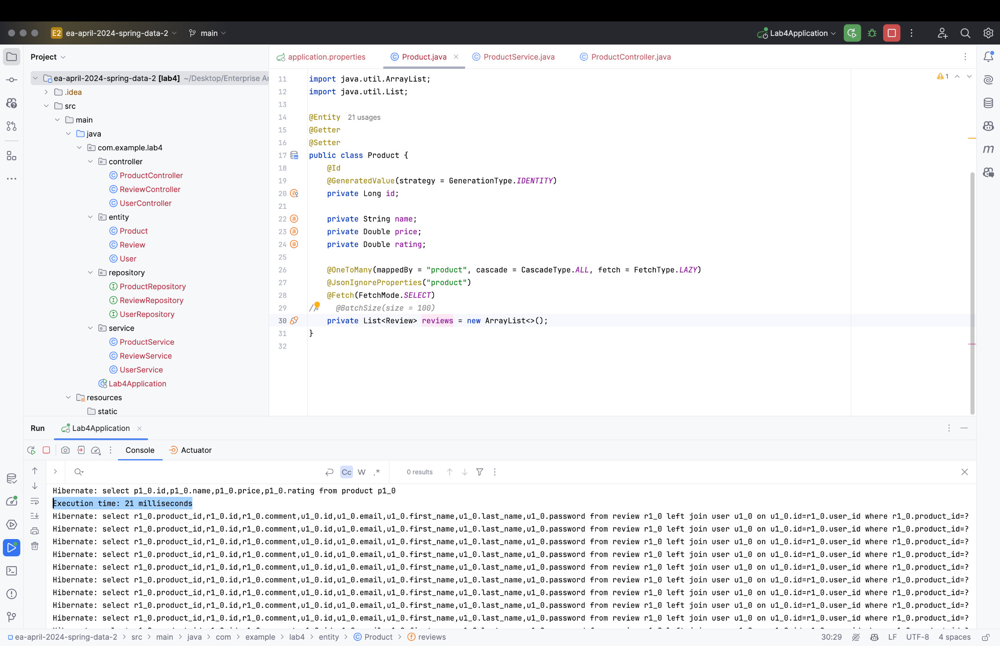
* **Memory Usage**: 162.56MB
* **Screenshot**: 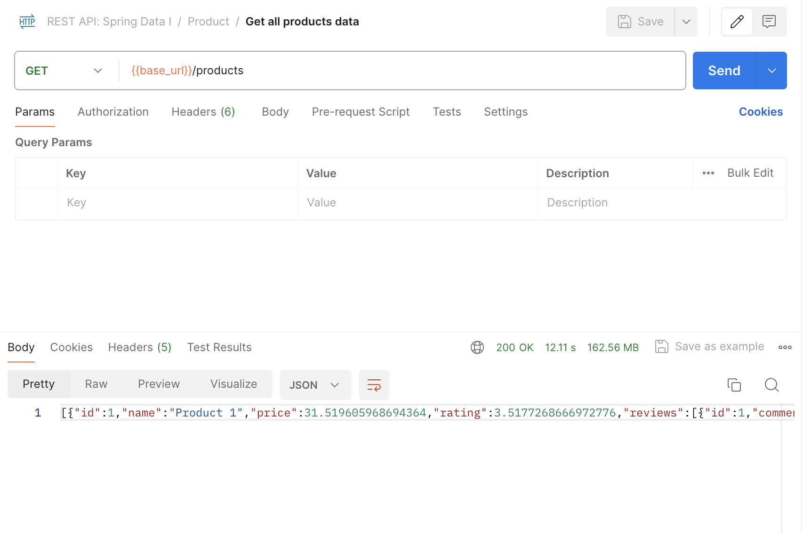

#### Fetch Strategy: `subselect`
* **Number of SQL Queries**: 1
* * **Sql Queries**: 
```sql
Hibernate: 
    select
        p1_0.id,
        p1_0.name,
        p1_0.price,
        p1_0.rating 
    from
        product p1_0

Hibernate: 
    select
        r1_0.product_id,
        r1_0.id,
        r1_0.comment,
        u1_0.id,
        u1_0.email,
        u1_0.first_name,
        u1_0.last_name,
        u1_0.password 
    from
        review r1_0 
    left join
        user u1_0 
            on u1_0.id=r1_0.user_id 
    where
        r1_0.product_id in (select
            p1_0.id 
        from
            product p1_0)
```
* **Execution Time**: 81 milliseconds
* **Screenshot**: 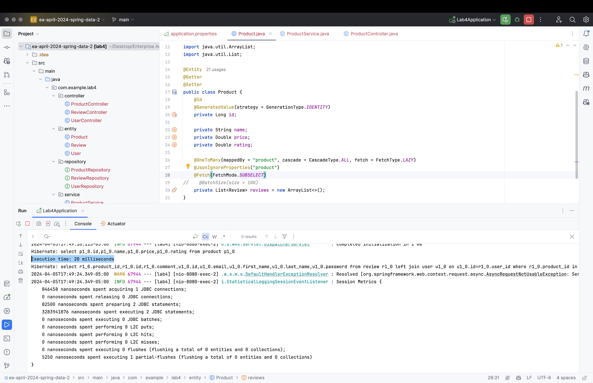
* **Memory Usage**: 162.56MB
* **Screenshot**: 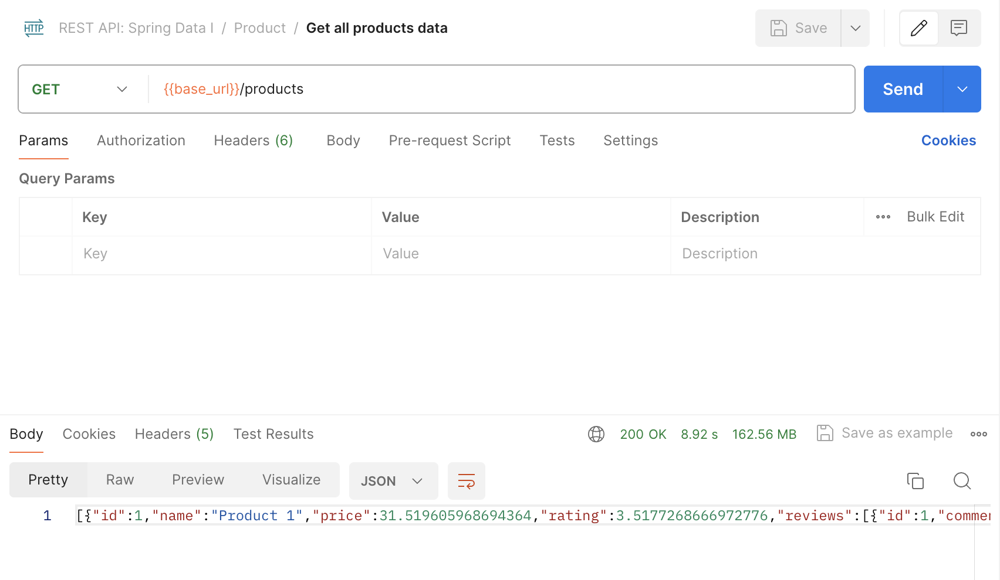

## Observations

#### Fetch Strategy: `batch`
* **Batch Size**: 100
* **Number of SQL Queries**: (total records / size of batch) + 1
* **Sql Queries**:
```sql
Hibernate: 
    select
        p1_0.id,
        p1_0.name,
        p1_0.price,
        p1_0.rating 
    from
        product p1_0

Hibernate: 
    select
        r1_0.product_id,
        r1_0.id,
        r1_0.comment,
        u1_0.id,
        u1_0.email,
        u1_0.first_name,
        u1_0.last_name,
        u1_0.password 
    from
        review r1_0 
    left join
        user u1_0 
            on u1_0.id=r1_0.user_id 
    where
        r1_0.product_id in (?, ?, ?, ?, ?, ?, ?, ?, ?, ?, ?, ?, ?, ?, ?, ?, ?, ?, ?, ?, ?, ?, ?, ?, ?, ?, ?, ?, ?, ?, ?, ?, ?, ?, ?, ?, ?, ?, ?, ?, ?, ?, ?, ?, ?, ?, ?, ?, ?, ?, ?, ?, ?, ?, ?, ?, ?, ?, ?, ?, ?, ?, ?, ?, ?, ?, ?, ?, ?, ?, ?, ?, ?, ?, ?, ?, ?, ?, ?, ?, ?, ?, ?, ?, ?, ?, ?, ?, ?, ?, ?, ?, ?, ?, ?, ?, ?, ?, ?, ?)
```
* **Execution Time**: 87 milliseconds
* **Screenshot**: 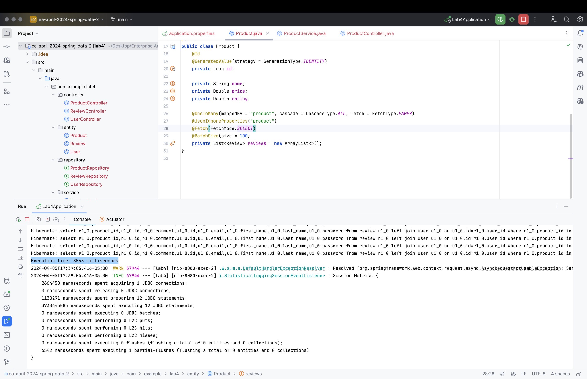
* **Memory Usage**: 162.56MB
* **Screenshot**: 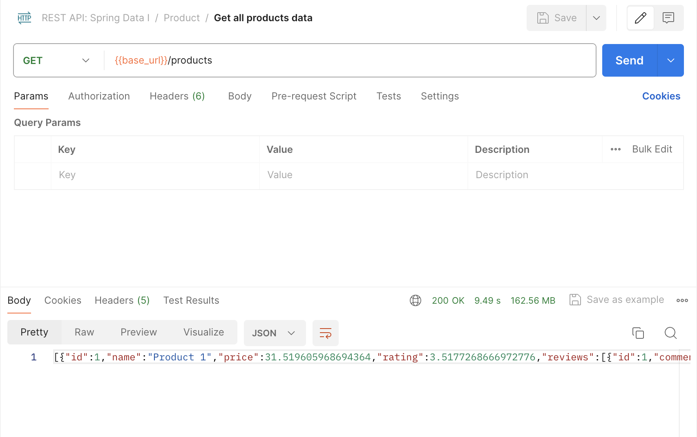


## Analysis - Charts
* **Query Comparison**: 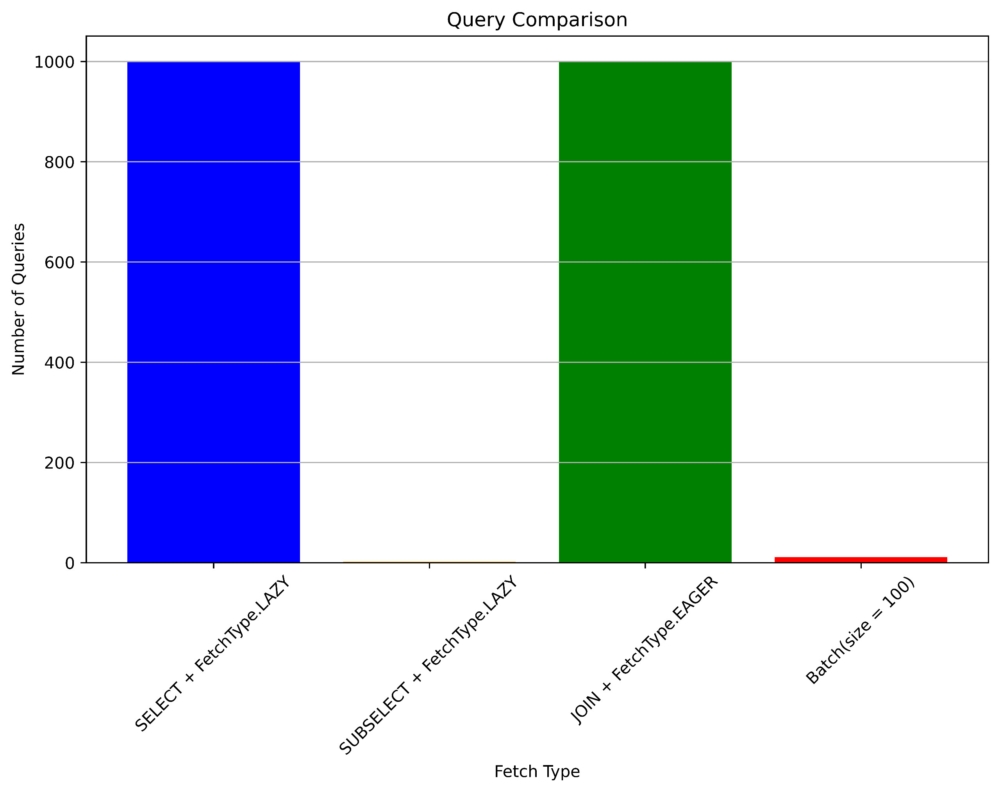
* **Performance Comparison**: 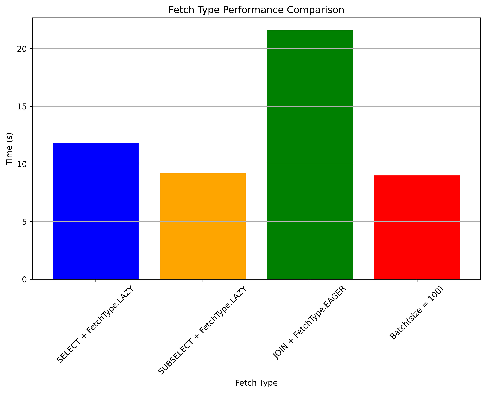
* **Memory Usage Comparison**: 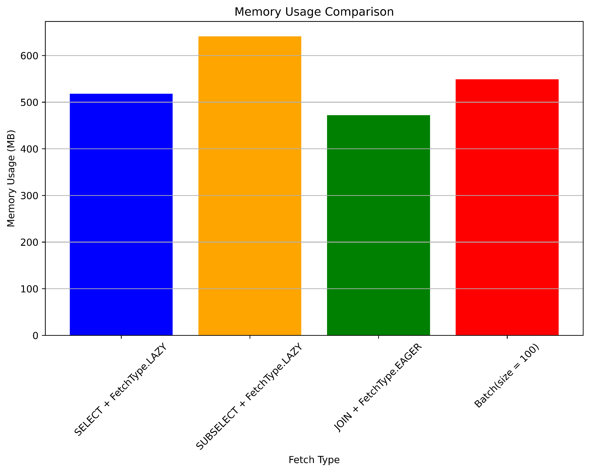

## Conclusion
The choice of fetching strategy depends on the specific use case. The select fetch strategy is best for scenarios where associated entities are rarely accessed, while the join fetch strategy is best for scenarios where associated entities are frequently accessed and the number of associated entities is small. The subselect and batch fetch strategies are best for scenarios where associated entities are frequently accessed and the number of associated entities is large.
