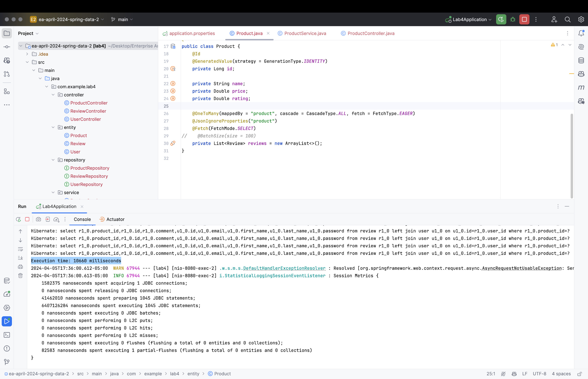

# Spring Data II

The goal of this assignment is to learn the fetching strategies supported by Spring Data JPA, understand their differences, and assess their impact on application performance. Through this exercise, you will learn how to optimize data retrieval in a Spring Boot application by employing various fetching strategies such as `select`, `join`, `subselect`, and `batch`.

###  Team Members - Omega
1. 617564 Thi Ngoc My Truong
2. 617590 Van Manh Nguyen
3. 617587 Quoc Hung Hoang

###  Requirements
---
* Make domain models for `user`,`product`, `review`.
* Populate the database with sample data including **at least** 100 users, 1000 products, and 1000 reviews for each product.
* Implement methods in your service layer, each demonstrating one of the fetching strategies (`select`, `join`, `subselect`, `batch`).
* Measure the number of SQL queries generated and the execution time for each fetching strategy.
* Analyze the differences in performance among the fetching strategies, focusing on the trade-offs between the number of queries generated and the overall execution time.
* Discuss the scenarios in which each fetching strategy would be most effective, considering factors such as data size, association complexity, and application requirements.

## Results - Fetching Strategies

## Observations - EAGER

#### Fetch Strategy: `select`
* **Number of SQL Queries**: N + 1
* **Execution Time**: 8563ms
* **Screenshot**: 
* **Memory Usage**: 162.56MB
* **Screenshot**: 

#### Fetch Strategy: `join`
* **Number of SQL Queries**: 1
* **Execution Time**: 10660ms
* **Screenshot**: 
* **Memory Usage**: 162.56MB
* **Screenshot**: 

#### Fetch Strategy: `subselect`
* **Number of SQL Queries**: N + 1
* **Execution Time**: 8052ms
* **Screenshot**: 
* **Memory Usage**: 162.56MB
* **Screenshot**: 

#### Fetch Strategy: `batch`
* **Number of SQL Queries**: (total records / size of batch) + 1
* **Execution Time**: 8563ms
* **Screenshot**: 
* **Memory Usage**: 162.56MB
* **Screenshot**: 

## Observations - LAZY

#### Fetch Strategy: `select`
* **Number of SQL Queries**: 1
* **Execution Time**: 12.11s
* **Screenshot**: 
* **Memory Usage**: 162.56MB
* **Screenshot**: 

#### Fetch Strategy: `join`
* **Number of SQL Queries**: 1
* **Execution Time**: 11.75s
* **Screenshot**: 
* **Memory Usage**: 162.56MB
* **Screenshot**: 

#### Fetch Strategy: `subselect`
* **Number of SQL Queries**: 1
* **Execution Time**: 8.92s
* **Screenshot**: 
* **Memory Usage**: 162.56MB
* **Screenshot**: 

#### Fetch Strategy: `batch`
* **Number of SQL Queries**: (total records / size of batch) + 1
* **Execution Time**: 9.49s
* **Screenshot**: 
* **Memory Usage**: 162.56MB
* **Screenshot**: 
